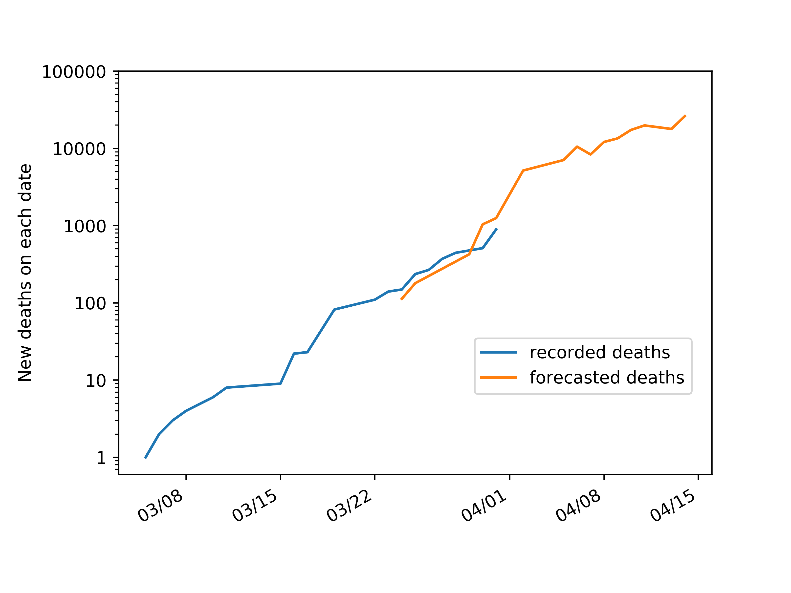

# covid-forecasts
Inferring the numbers of deaths in weeks to come from growth over the past weeks

# Motivation
I have become concerned about uncertainty in epidemiological parameters of the pandemic being used to question the appropriateness of governments' responses. As I argue below, near-term forecasts can be made by combining direct observations and a single adjustable parameter that is well constrained.

# Data
Data is sourced from Johns Hopkins University's https://github.com/CSSEGISandData/COVID-19/tree/master/csse_covid_19_data/csse_covid_19_time_series

# Model
Let N be the number of deaths recorded today, D the true death rate, L the average lag between infection and death, and F the factor by which cases increased over the prior L days. Then the true number of infections L days ago was N/D, the true number of infections today is N/D x F, and the predicted number of deaths L days from now is N/D x F x D = N x F. This value is independent of the death rate, which is uncertain due to insufficient testing. L = 14 produces good fits for the days where recorded deaths and forecasts overlap, and F is obtained directly from the time series of confirmed cases. Note that this method does not require any assumptions about the underlying model of time evolution and naturally incorporates changes in growth due to, e.g, social distancing.

# Current Forecast

# Caveats
-I am not an expert.

-These forecasts are fundamentally imprecise and should be taken as order-of-magnitude estimates only.

-I am assuming that the death rate is fixed. It can vary if hospitals become overwhelmed, new treatments emerge, etc.

-The lag time is just an average. In reality there is a distribution, which causes spillover between forecasts on nearby dates.

-I am assuming that the factor by which confirmed cases increase in a given period is the same factor by which true cases increase. In reality this is confounded somewhat by changes in testing rates.

# Retrospect
These forecasts came out (thankfully) much too high. The reason is likely that my assumption that "the factor by which confirmed cases increase in a given period is the same factor by which true cases increase" is a bad one, because in fact there is a significant lag between infection and a positive test result, which I hadn't considered (this issue is explored [here](https://fivethirtyeight.com/features/coronavirus-case-counts-are-meaningless/)). It is of some comfort that other scientists made the same [mistake](https://sfi-edu.s3.amazonaws.com/sfi-edu/production/uploads/ckeditor/2020/04/06/t-003-luu-jost.pdf). Nevertheless, as of 06/24 the virus has claimed the lives of 124,000+ people in the US, and while I wish I could have made more useful predictions, I do not regret advocating that the virus be taken more seriously than it was at the time I started this project. 

