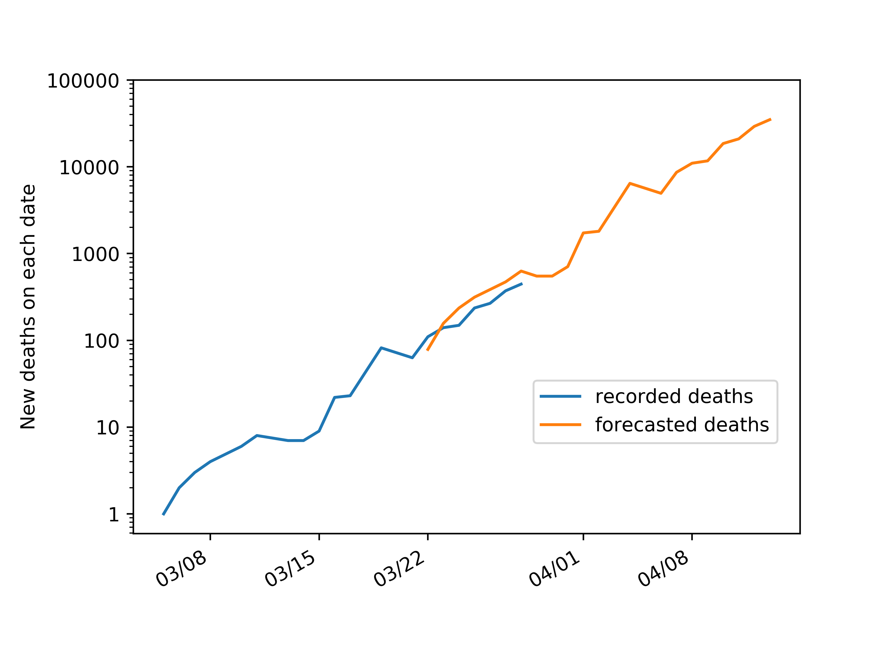
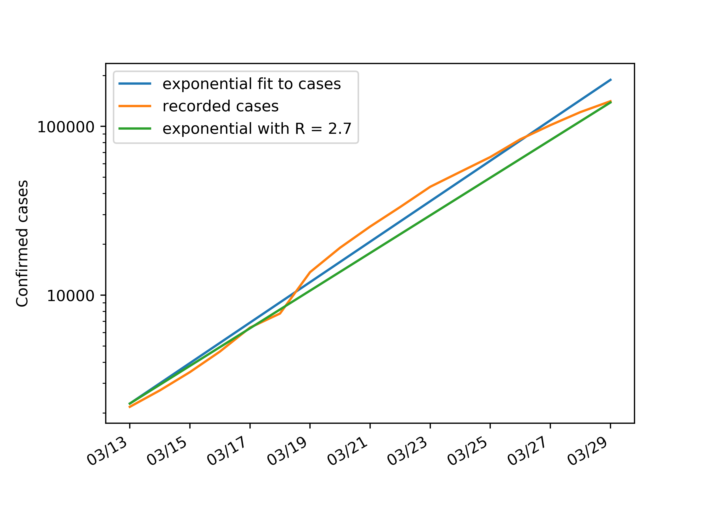

# covid-forecasts
Inferring the numbers of deaths in weeks to come from growth over the past weeks

# Motivation
I have become concerned about uncertainty in epidemiological parameters of the pandemic being used to question the appropriateness of governments' responses. As I argue below, near-term forecasts can be made on the basis of parameters that are reasonably well constrained. 

# Data
Data is sourced from Johns Hopkins University's https://github.com/CSSEGISandData/COVID-19/tree/master/csse_covid_19_data/csse_covid_19_time_series

# Model
Let N be the number of deaths recorded today, D the true death rate, L the average lag between infection and death, and R the doubling time over the last L days. Then the true number of infections L days ago was N/D, the true number of infections today is N/D x 2^(L/R), and the predicted number of deaths L days from now is N/D x 2^(L/R) x D = N x 2^(L/R). Note that this value is independent of the death rate, which is uncertain due to insufficient testing. L is assumed to be 17 and R is chosen by hand to produce the best fit (see Caveats). Current value is R = 2.7.

# Current Forecast

# Caveats
These forecasts are imprecise and intended for order-of-magnitude estimates only. Recent quarantines mean that growth over the last 17 days is in fact sub-exponential. Assuming an exponential and choosing R to hit the cases curve today makes the end of my forecast accurate, but underestimates the forecasted deaths on more recent days. I hope to soon update the sophistication of my growth model, see https://bit.ly/39rTE43

